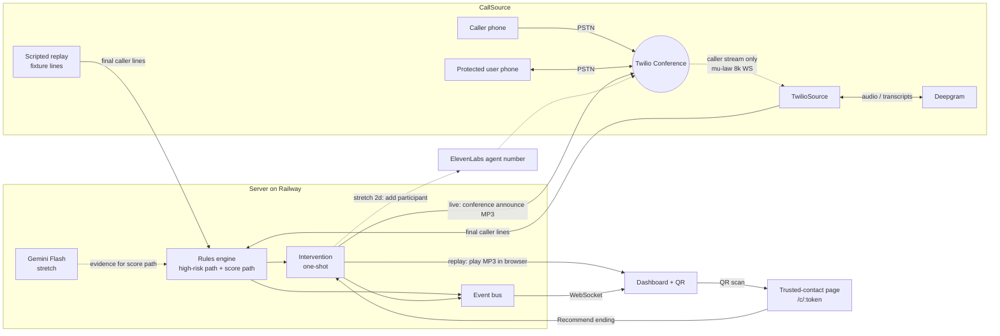

# Scam Call Shield: Final Plan

RowdyHacks, 24 hours. Targets the Swivel "Social Engineering Shield" track and the ElevenLabs voice track.
This plan merges four plans: `plan.md` (our decision thread), the two uploaded `plan.md` variants, and `suggested-plan.md`.

**The rule for this plan:** one end-to-end loop that cannot fail on stage is done by **hour 8**. Everything else is a layer on top, and each layer has a go/no-go gate. A layer that misses its gate gets cut, and nobody re-architects.

---

## 1. Pitch in one line

**Detect → warn out loud → bring in someone you trust.** Scam Call Shield listens to a call routed through our number. When the caller makes a scam-style demand, it speaks an ElevenLabs warning into the call and lets a trusted family member weigh in from their phone.

Boundary (say it on stage): the prototype protects calls routed through our Twilio number. It doesn't screen every call on a phone yet. The `CallSource` adapter is where a carrier or phone app would plug in.

---

## 2. What we ship

### Tier 0: guaranteed MVP (must be done by hour 8, no phone network needed)

1. **Scripted replay.** A "Run scam call" button streams a printed gift-card scam script, line by line, through the real engine. A second button runs a benign appointment script.
2. **Rules engine.** Weighted categories plus high-risk "auto-flag" phrases, locked to the fixtures and covered by one test command.
3. **Dashboard.** It shows the caller's transcript, a heuristic risk score climbing, an evidence card quoting the demand, and the state (monitoring → warning → contact review → ended).
4. **ElevenLabs warning.** Pre-generated MP3s play out loud: *"This call has been flagged as a potential scam. The caller is asking you to pay with gift cards. Please hang up immediately."*
5. **Trusted contact.** The dashboard shows a QR code. The "granddaughter" scans it on her phone and sees the quoted demand. She taps **Recommend ending this call**, and the room hears *"Your trusted contact recommends you end this call."*
6. **Benign replay** ends on "No suspicious request detected so far."

### Tier 1: live phone call (spike in hours 0–4; gates at hours 4 and 12)

A teammate calls our Twilio number and the server dials the protected user into a Twilio Conference. Only the caller's audio is streamed to Deepgram. Its final transcripts run through the **same engine and the same events** as replay. The warning and contact clips play to **both phones** through conference announce.

### Tier 2: stretch, in this order, only after Tier 0 has been rehearsed

| # | Stretch | Gate / hard stop |
|---|---|---|
| 2a | **Gemini Flash** paraphrase detection on finalized caller lines feeds the score path | Start at hour 8 or later; rules keep working if it fails |
| 2b | **VoIP badge** from Twilio Lookup line type, display only | 1 hour, any time after hour 8 |
| 2c | **SMS link to trusted contact**, only if A2P 10DLC registration is approved | Registration must be started at hour 0 |
| 2d | **ElevenLabs challenge agent** joins the conference after the warning | Spike from hour 12 to hour 16, then a hard stop |

### Cut or changed from earlier plans, and why

| Earlier idea | Final call | Why |
|---|---|---|
| Score threshold 100 with a 40-point cap per category (our plan) | **70 points across ≥3 distinct categories**, one award per category | 100 needed 4+ categories, so the score path almost never fired. 70 means payment + secrecy + urgency trips. |
| Auto-flag phrases (our plan) | Kept, renamed the **high-risk path** | All four plans converged on it. It's the demo trigger because it's deterministic. |
| Gemini can trip an auto-flag at confidence ≥ 0.85 | Gemini only adds **evidence to the score path**. It **cannot** fire the high-risk path. | Model confidence isn't calibrated, and the stage trigger must never depend on a model. |
| VoIP number gives +20 head start; bad caller ID +15 | **Display-only badge** | A doctor or small business calling from a VoIP line is normal. Content beats metadata. Points from metadata also make false alarms more likely at the 70 threshold. |
| STIR/SHAKEN grade in the score | **Cut** | A "C" grade isn't a failed verification. That's an easy way to mislead judges. |
| Victim transcript lane (second stream) | **Cut** | It doubles the audio plumbing and adds nothing to detection, since only the caller is scored. |
| ElevenLabs agent asks for badge ID / callback and returns "passed" | **Stretch 2d**, reworded: the agent tells the caller the call is being screened and asks them to state the purpose. It never says "verified", "passed", or "safe". "Caller hung up" is shown as **Caller disconnected**. | A real scammer can make up a badge ID, so "passed" would give false reassurance. Turn-taking in a 3-way conference is the riskiest integration we have. |
| SMS text with live link (our plan) | **QR code is the MVP**; SMS is stretch 2c | Unregistered US texts are blocked and approval takes days. A QR code always works. |
| Live call as the main demo | Live call is the **opener only if the morning check passes**; the **labeled replay is the show** | Venue Wi-Fi and phone networks are the most common reason demos die. |
| Replay by piping recorded audio through Deepgram | **Scripted transcript events** | Same engine path, no dependency on speech services, and deterministic. |
| Legitimate-pattern score reductions, "scripted phrasing" signal, personal-info category | **Cut** (personal-info kept as fixture idea for later) | More rules mean more tuning. Benign fixtures already prove we don't over-fire. |
| Dashboard login, monorepo packages | **Cut** | The demo boundary is the contact token. Two folders are enough. |
| Railway hosting | **Kept**: one fixed HTTPS/WSS URL from hour 0, never rotated | Twilio webhooks die when a tunnel URL changes. |
| Email plugin | **Cut** (pitch roadmap only) | Out of 24 hours. |

---

## 3. Architecture

**Stack (unchanged from our decisions):** Node + TypeScript with Fastify + `@fastify/websocket` · React + Vite + Tailwind · Deepgram live STT · ElevenLabs (pre-generated MP3s) · Twilio Voice (Conference + Media Streams) · Gemini Flash (stretch) · Railway.



### CallSource interface

```ts
interface CallSource {
  kind: "replay" | "twilio";
  start(session: Session): Promise<void>;
  onFinalLine(cb: (text: string) => void): void;     // caller only
  onInterimLine?(cb: (text: string) => void): void;  // display only, never scored
  play(clip: ClipId): Promise<"played" | "failed">;  // twilio: conference announce; replay: browser
  onEnd(cb: () => void): void;
}
```

### Live call sequence (Tier 1)

1. The caller dials number A. `POST /twilio/voice` (signature validated) creates a session. It returns TwiML that starts an `inbound_track` stream with `role=caller` and joins `conf-{sessionId}`.
2. The server dials the protected user into the same conference **with no stream**.
3. Caller audio goes to **one** Deepgram socket (`encoding=mulaw&sample_rate=8000&interim_results=true&endpointing=300`). Interim results show as grey text, and final results go to the engine.
4. On trigger, the server updates the conference with `AnnounceUrl` → TwiML `<Play>` of the matching clip, and creates the contact token. Nothing waits on announcement status.
5. **Recommend ending** plays `contact-end-call.mp3` once. **More review needed** updates the dashboard only.
6. A participant-leave event shows **Caller disconnected**. When the session ends, the stream closes and the token stops working.

---

## 4. Detection

The score is a **heuristic risk score**. It isn't a probability, and the UI never shows a percentage.

### Categories (one award per category per call)

| Category | Points | Qualifies when |
|---|---|---|
| Suspicious payment | 30 | Gift cards, crypto, or wire demanded **as payment** |
| Sensitive access | 30 | Asked to read a login code aloud, or to install remote access / give screen control |
| Secrecy / isolation | 25 | "Don't tell your bank / family" |
| Authority + demand | 20 | A first-person claim of an office ("This is the county clerk's office") **plus** a demand in the window. Just mentioning the IRS earns nothing. |
| Urgency / threat | 15 | "Settled today", "within the hour", lock the account, police, tied to a demand |

### Two trigger paths, one intervention

1. **High-risk path (Bilal's auto-flags):** an action+context phrase appears in the latest 6 final caller lines. It fires at any score, and the dashboard names the path and quotes the line.
   - Gift cards demanded as payment: "buy gift cards and read me the codes"
   - A login code demanded: "read me the login code we just sent"
   - Remote access plus a threat: "give me control of the screen" + "lock the account" / "contact the police"
2. **Score path:** score ≥ 70 **and** ≥ 3 distinct categories. Payment 30 + secrecy 25 + urgency 15 = 70.

**Rules:** interim text is never scored. A repeated line can't award a category twice. An `intervened` flag makes the warning one-shot, including against late results. Gemini (stretch) can only add a category award, and only through the same dedupe.

### Must NOT fire

- "Download this app so we can talk"
- A gift-card mention that isn't a payment demand (birthday gift cards)
- Talking about an arrest warrant with no demand
- A code in a notification with nobody asking to read it aloud
- Recounting a past scam ("the guy said he was the IRS and told me to buy gift cards… I hung up")

### Fixtures (`server/fixtures/*.json`, run by `npm test`)

**Gift-card scam (stage script; line 3 triggers):**
1. "This is the county clerk's office. There is a civil filing in your name."
2. "It has to be settled today or the filing goes forward."
3. "You need to buy gift cards and read me the codes on the back."
4. "Do not tell your bank, and do not talk to your family until the codes are in."

**Appointment (benign stage script):** "Hi, this is the clinic on Main. I'm calling to confirm your Thursday appointment at 2:30." / "Please arrive ten minutes early and bring your insurance card." / "If you need to reschedule, call the front desk."

**Test-only:** remote-access scam, login-code scam, birthday gift cards, past-scam recount, and a score-path-only scam (secrecy + urgency + payment by wire with no high-risk phrase).

---

## 5. Voice clips (generated with ElevenLabs in hour 1)

The clips use a calm voice, Bilal's original sentence as the frame, and the behavior named in the middle.

| File | Copy |
|---|---|
| `warning-gift-card.mp3` | "This call has been flagged as a potential scam. The caller is asking you to pay with gift cards. Please hang up immediately." |
| `warning-remote-access.mp3` | "…The caller is asking for control of your computer. Please hang up immediately." |
| `warning-login-code.mp3` | "…The caller is asking you to read a code aloud. Please hang up immediately." |
| `warning-score.mp3` | "…The caller is pressuring you for money and asking you to keep it secret. Please hang up immediately." |
| `warning-fallback.mp3` | "This call has been flagged as a potential scam. Please hang up immediately." |
| `contact-end-call.mp3` | "Your trusted contact recommends you end this call." |

---

## 6. Dashboard and contact page

**Dashboard (one page):**
- The caller transcript, with interim text dim and final text solid.
- The risk score, labeled "heuristic".
- An evidence card showing the category, the trigger path, and the quoted line.
- A state pill.
- The QR code for the contact link.
- The contact's recommendation.
- Replay buttons, plus a **"Scripted simulation"** label while replay runs.
- Connection dots for the WebSocket and the caller stream.
- Stretch: the VoIP badge, labeled "informational".
- No "safe" or "verified" badges anywhere.

**Contact page `/c/:token`:**
- Phone-sized, with large text.
- The quoted demand first, then a one-sentence explanation.
- Two big buttons.
- A line saying "Your answer is advice, not identity verification."
- The token is high-entropy, works for one call only, and expires when the session ends.

---

## 7. Team split (assign names at hour 0)

| Track | Owns |
|---|---|
| **A: Phone** | Railway URL, Twilio conference, announce, caller stream, Deepgram |
| **B: Engine** | Fixtures, rules, tests, Gemini (stretch) |
| **C: Experience** | ElevenLabs clips, dashboard, contact page, QR, replay buttons |
| **D: Pitch** (or C after hour 12) | Script, slides, one cited FTC scam-loss statistic, rehearsal lead |

With 3 people, C also takes D after hour 12. Working solo, the order is B → C → A.

---

## 8. Hour-by-hour schedule

Two sleep shifts are built in. Nobody codes 24 hours straight.

| Hours | A: Phone | B: Engine | C: Experience | Done when |
|---|---|---|---|---|
| **0–1** | Create Railway app and deploy hello world (fixed URL). Upgrade Twilio from trial. Buy number A. **Start A2P 10DLC sole-prop registration.** | Repo skeleton (`server/`, `web/`, `assets/`), TS config, shared `events.ts` | ElevenLabs account; write clip copy | URL live; keys in Railway env |
| **1–4** | **Spike:** call number A → conference → dial user → test MP3 announced on **both phones**. Then attempt caller `inbound_track` stream reaching server. | Write all fixtures as JSON; build the rules engine against them; `npm test` | Generate the 6 MP3s; static dashboard + contact page with fake data | Fixtures pass; clips exist |
| **Gate @4** | If both phones heard the MP3, keep the conference. If not, **stop telephony**, document it, and use browser playback. Don't start a SIP bridge. | | | |
| **4–8** | Deepgram on the caller stream (if it connected); print final lines to the log | `ReplaySource` + event bus + `intervened` flag + contact token | Dashboard wired to the WebSocket, QR, contact page buttons, browser audio playback | **Tier 0 MVP works end to end on replay** |
| **8–12** | `TwilioSource` feeds the same engine; read the gift-card script live and see **one** trigger; contact clip announced in the call; Twilio signature check | Gemini Flash on final lines → score-path evidence (2a) | Polish the evidence card and state pill; VoIP badge via Lookup (2b) | Live path works once, or is cut |
| **Gate @12** | Tier 0 is rehearsed once with a second phone on the QR. If the live path has failed twice, it becomes a **mention**, not a demo beat. | | | |
| **12–16** | **Sleep shift 1** (A + B) | Stretch 2d agent spike: add agent number as conference participant after the warning; **hard stop at 16** | C: SMS link if 10DLC is approved (2c); D: slides + statistic | |
| **16–20** | Back on. Full rehearsal ×2 (replay + live opener) | Fix only rehearsal failures | **Sleep shift 2** (C + D) | Two clean runs |
| **20–22** | **Freeze.** Morning check on the venue network: does a live call play the MP3 on both phones? Record a backup screen video of the replay demo. | | | Decide live opener yes/no |
| **22–24** | Buffer: submit to Devpost (Swivel + ElevenLabs tracks), final rehearsal, rest | | | Submitted |

**After the freeze, don't add** Gemini, the agent, SMS, new rules, weight changes, or email.

---

## 9. Two-minute demo

1. **15 s:** Hook with one cited statistic. Scammers win by rushing people before they can think.
2. **45 s:** The gift-card call. It's live only if the morning check passed; otherwise press **Run scam call** (labeled "Scripted simulation"). The score climbs, line 3 hits the high-risk path, the evidence card quotes it, and the warning plays.
3. **30 s:** The "granddaughter" scans the QR code and taps **Recommend ending this call**, and the contact clip plays. Say: "Advice from someone you trust, not a verdict."
4. **20 s:** Press **Run appointment call**. The screen shows "No suspicious request detected so far."
5. **10 s:** The boundary plus the roadmap: carrier and app integration through `CallSource`, the same engine for email, and a voice agent.

If the live opener fails, say "here's the same call as a scripted simulation" and press replay. Don't troubleshoot on stage.

---

## 10. Verification checklist (before freeze)

- [ ] The gift-card script fires exactly once on line 3 via the high-risk path, and `warning-gift-card.mp3` plays.
- [ ] Remote-access and login-code fixtures each fire once, with their own clip.
- [ ] The score-path fixture fires at ≥ 70 with 3 categories.
- [ ] The appointment, birthday, past-scam, "download this app", warrant-mention, and bare-code fixtures don't fire.
- [ ] Interim text doesn't change the score. A repeated line doesn't double-award.
- [ ] The `intervened` flag blocks a second warning. A double contact tap plays the clip once.
- [ ] A token for one call can't open another, and it expires when the session ends.
- [ ] An invalid Twilio signature is rejected.
- [ ] A failed warning playback shows on the dashboard, and the contact page still works.
- [ ] Gemini down or timing out (stretch) leaves the rules fully working.

---

## 11. Do right now

1. Name the owners of tracks A–D.
2. Create the Railway app, write down the URL, and agree nobody rotates it.
3. Upgrade Twilio, buy number A, and **submit the 10DLC registration** (free to start, and it unlocks stretch 2c).
4. Get keys: Deepgram, ElevenLabs, Gemini (Google AI Studio).
5. Print the gift-card and appointment scripts.
